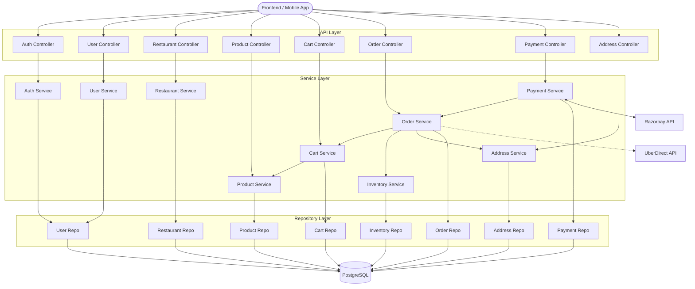

# System Architecture

## Current Backend Architecture

This diagram represents the current state of the **Food Wagon Backend**.

```mermaid
graph TD
    %% Clients
    Client([Frontend / Mobile App])

    %% API Layer
    subgraph APILayer [API Layer]
        AuthAPI[Auth Controller]
        UserAPI[User Controller]
        RestAPI[Restaurant Controller]
        ProdAPI[Product Controller]
        CartAPI[Cart Controller]
        OrderAPI[Order Controller]
        PayAPI[Payment Controller]
        AddrAPI[Address Controller]
    end

    %% Service Layer
    subgraph ServiceLayer [Service Layer]
        AuthSvc[Auth Service]
        UserSvc[User Service]
        RestSvc[Restaurant Service]
        ProdSvc[Product Service]
        CartSvc[Cart Service]
        OrderSvc[Order Service]
        PaySvc[Payment Service]
        AddrSvc[Address Service]
        InvSvc[Inventory Service]
    end

    %% Repository Layer
    subgraph RepositoryLayer [Repository Layer]
        UserRepo[User Repo]
        RestRepo[Restaurant Repo]
        ProdRepo[Product Repo]
        CartRepo[Cart Repo]
        OrderRepo[Order Repo]
        PayRepo[Payment Repo]
        AddrRepo[Address Repo]
        InvRepo[Inventory Repo]
    end

    %% Database
    Database[(PostgreSQL)]

    %% External Services
    Razorpay[Razorpay API]
    UberDirect[UberDirect API]

    %% Connections
    Client --> AuthAPI
    Client --> UserAPI
    Client --> RestAPI
    Client --> ProdAPI
    Client --> CartAPI
    Client --> OrderAPI
    Client --> PayAPI
    Client --> AddrAPI

    AuthAPI --> AuthSvc
    UserAPI --> UserSvc
    RestAPI --> RestSvc
    ProdAPI --> ProdSvc
    CartAPI --> CartSvc
    OrderAPI --> OrderSvc
    PayAPI --> PaySvc
    AddrAPI --> AddrSvc

    OrderSvc --> CartSvc
    OrderSvc --> InvSvc
    OrderSvc --> AddrSvc
    CartSvc --> ProdSvc
    PaySvc --> OrderSvc

    AuthSvc --> UserRepo
    UserSvc --> UserRepo
    RestSvc --> RestRepo
    ProdSvc --> ProdRepo
    CartSvc --> CartRepo
    OrderSvc --> OrderRepo
    PaySvc --> PayRepo
    AddrSvc --> AddrRepo
    InvSvc --> InvRepo

    UserRepo --> Database
    RestRepo --> Database
    ProdRepo --> Database
    CartRepo --> Database
    OrderRepo --> Database
    PayRepo --> Database
    AddrRepo --> Database
    InvRepo --> Database

    PaySvc <--> Razorpay
    OrderSvc -.-> UberDirect
```
